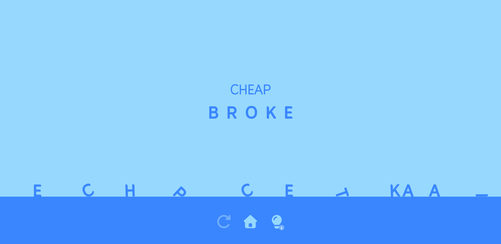
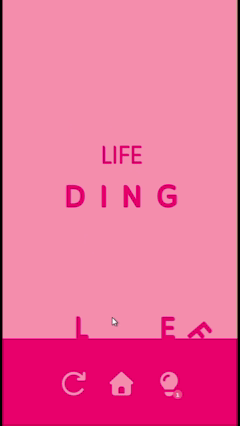
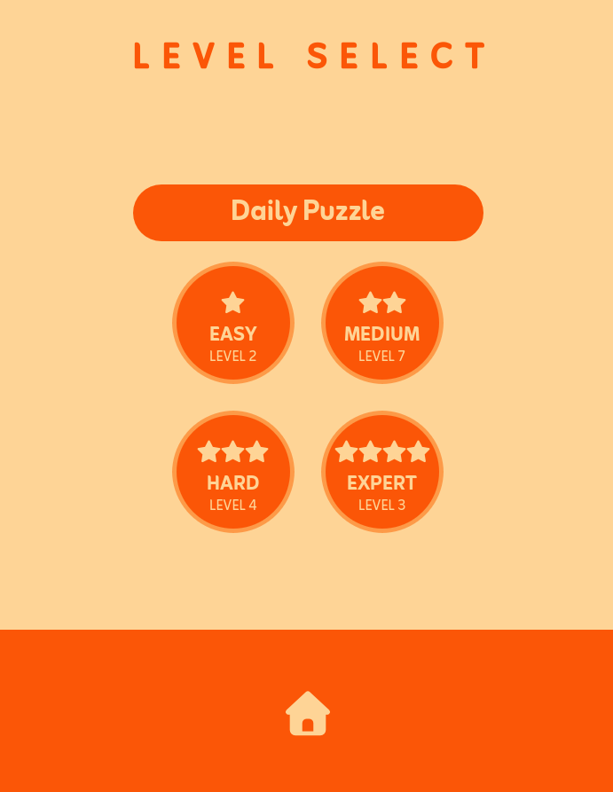
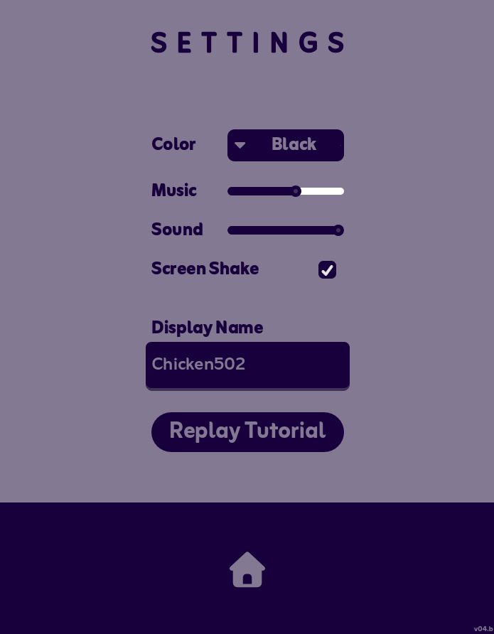

# Word Chains
current version : v0.3b

Word Chains is a word puzzle game made in Godot 4.7. In it you try to reach the target word by changing only one letter at a time. [Play it now on itch.io](https://chicken502.itch.io/word-chains)

## Credits
- Chicken502: Lead, Design, Programming, Music and Sound

- Splash screen made by Guhnahdahb, and you can check it out [here](https://guhnahdahb.itch.io/godot-splash-screen-gnd-pop)!

- Fonts used were [Zain](https://fonts.google.com/specimen/Zain) and [Font Awesome](https://fontawesome.com/)

## More about this project
This project was first started back in May of 2026, but once first published, it didn't receive any updates, although it was meant to. The old code can be viewed at https://github.com/Chiken502/Word-Chains 
Then in late July of 2026, I decided to come back to this project and I completely reworked most of the code. Since then I've been slowly updating it when I can and hopefully I will finish it this time around. 

So far the code base has been completely reworked, with completely new UI, effects, and music. Then I added more levels, a level select system, save files.

  

#### The game can currently be played at https://chicken502.itch.io/word-chains

## License
- This project is under 'MIT' License

## Updates
### v0.3b, 9/6/26
- Linux and Windows builds
- 5 new levels
- Level select screen
- Game save changes

### v0.21b, 8/29/26
- Added fullscreen support
- Fixed settings icon color changing
- Fixed Phantom letter bug
- Added sound effects for the Godot splash screen

### v0.2b, 8/23/26
Complete overhaul of game including:
- Complete UI reworked
- Hints!
- All new sound effects and music

### v0.1b, 6/8/26
Initial beta release of Word Chains
- 15 Levels across three difficulties
- Basic functionality for changing letters and checking words
- Undo button implemented

## File Structure
Here is a little about how my organization system for this project works.
  ##### Audio
  Holds all audio files for SFX and music. Also has the Audio Bus Layout resource file.
  
  ##### Classes
  This folder contains code for custom Godot classes. Currently the only class is the ColorAgent which handles color changing scenes on load.

  ##### ExampleImgs
  This folder is purely for this README file and is not used by Godot in any way. In it you will find the game play photos above.

  ##### Fonts
  Holds all font files for this game. This game uses Zain for all the text that you see, and it uses Font Awesome 7 for the icons.

  ##### Globals
  This folder holds all the important scripts that are auto loaded at the start of the game. These scripts can then be accessed through out the rest of the code base. This folder also holds the dictionary that is used for determining if a word is valid.

  ##### LetterImages
  This folder contains images for letters that was generated by a function in [this script](https://github.com/Chiken502/WordChains/blob/main/_Components/Scripts/falling_letter.gd). These images are then used to create the collision polys for each letter, so that they interact correctly.

  ##### Resources 
  This folder contains resource files, like svg icons (they are .txt for color changing reasons), theme resources, and label settings.

  ##### _Components
  This folder contains reused nodes, that aren't frames. These include falling letters, and level buttons. Stuff that needs to be instantiated during the game.

  ##### _Frames
  Frames are screens that are used in game. These include frames like settings, credits, main menu, ect.

  ##### _GameFrame
  The main game frame, holds extra scripts for the game frame.

  ##### Addons
  Contains addons used in the project.

  ##### Godot Splash PNGs
  This holds all the frames for the Godot splash screen at the start. This splash screen can be downloaded [here](https://guhnahdahb.itch.io/godot-splash-screen-gnd-pop) and was made by Guhnahdahb.

Notes: some files like `.import`, and `.uid` aren't really needed as they are generated by godot.
